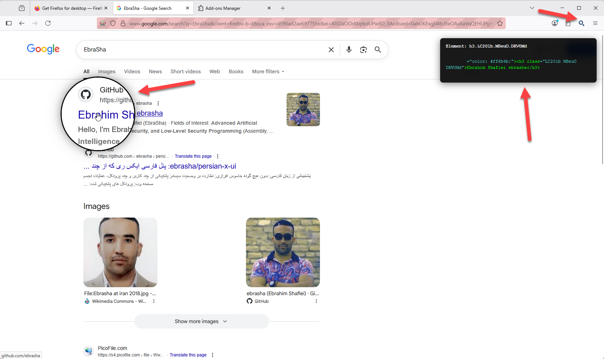

# Abdal MagniCode

  

## 📘 Other Languages
- [🇮🇷 Persian - فارسی](README.fa.md)

---

## 🚀 Introduction

**Abdal MagniCode** is a Firefox extension built to replace the traditional "Inspect Element" tool with a visually rich and interactive magnifier-based inspector. It allows developers, security analysts, and learners to inspect HTML elements live using a customizable magnifying glass — without needing DevTools.

Whether you're debugging UI elements, teaching HTML, or just want a clearer view of page structure, Abdal MagniCode provides an efficient, visually compelling alternative.

---

## ✨ Features

- 🔍 **Live Magnifier:** Real-time zoom around the cursor with adjustable size and scale
- 💻 **Code Preview:** Live display of HTML structure under the lens
- 🎯 **Auto Copy:** Optional automatic copying of inspected elements
- 🎨 **Highlighting:** Syntax colorization for better readability
- 🧰 **Settings UI:** Windows 11-style glassmorphic panel
- 🛡️ **Cross-site Safe:** Works on almost all sites with isolated CSS
- ⌨️ **Shortcuts:** ESC to close, Ctrl+S to save, Ctrl+R to reset

---

## 🧩 How to Install

### 🔹 Install from Firefox Add-ons

1. Open Firefox
2. Go to `about:addons` or visit the **Add-ons Manager**
3. Search for **Abdal MagniCode**
4. Click **Install** and enjoy the extension
---

## 📖 How to Use

- **Right-click** anywhere and choose *Abdal MagniCode*
- Or **click the toolbar icon**
- Hover your mouse to magnify content
- Click on any element to see and copy its HTML
- Open settings to customize magnification level, opacity, and more

---

## 🐛 Reporting Issues

If you encounter any issues or have configuration problems, please reach out via email at Prof.Shafiei@Gmail.com. You can also report issues on GitLab or GitHub.

## ❤️ Donation

If you find this project helpful and would like to support further development, please consider making a donation:
- [Donate Here](https://alphajet.ir/abdal-donation)

## 🤵 Programmer

Handcrafted with Passion by **Ebrahim Shafiei (EbraSha)**
- **E-Mail**: Prof.Shafiei@Gmail.com
- **Telegram**: [@ProfShafiei](https://t.me/ProfShafiei)

## 📜 License

This project is licensed under the GPLv2 or later License.